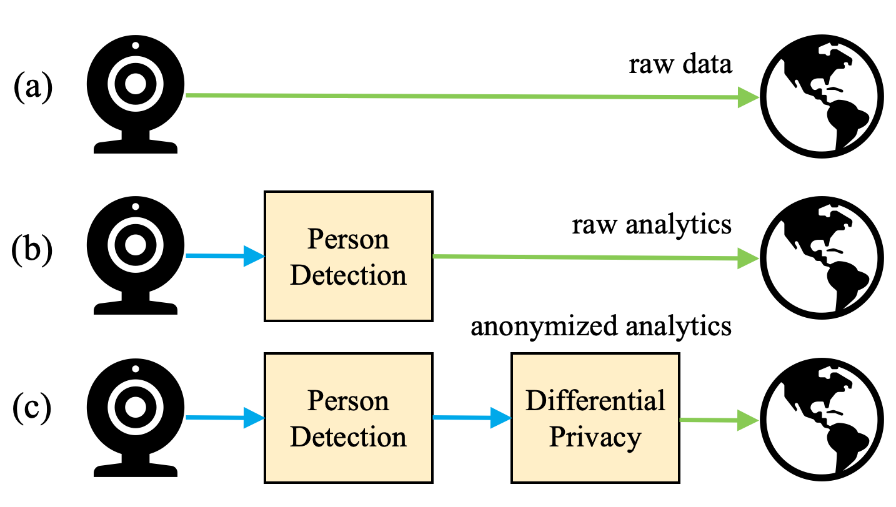

# Karl
Karl is a _home cloud_ for cheap IoT devices to execute as much functionality
as possible on user-owned hardware.
Rather than using cloud services and local device state, devices (or sensors)
in the home cloud express the majority of functionality in terms of small,
ephemeral units of computation called _modules_.

When functionality must be offloaded to the cloud, the user can define
_pipeline policies_ that justify when data can be exfiltrated and specify
which modules must first transform the data.



## Quick Start
Install dependencies. On prompt, select "1) Proceed with installation (default)".

```
source scripts/install_dependencies.sh
```

TODO

In a secure deployment, set your own password and don't autoconfirm.

## Web UI

Explore the web UI for confirming sensors and hosts, registering
modules, manually spawning modules, and defining pipeline policies at
`<CONTROLLER_IP>:8080` in a browser.

## Resources
* [Fog computing](https://en.wikipedia.org/wiki/Fog_computing)
* [Karl the Fog](https://en.wikipedia.org/wiki/San_Francisco_fog)
