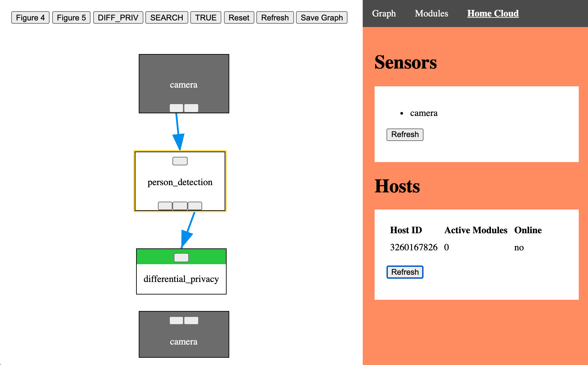

# Karl
Karl is a privacy-preserving framework that IoT devices can use to execute as
much functionality as possible on a _home cloud_ that runs on user-owned hardware.
Rather than relying on third-party cloud services and local device state,
devices (_sensors_) in the home cloud express their functionality in terms
of small, ephemeral units of computation (similar to serverless) called _modules_.
When functionality _must_ be offloaded to the cloud, users define
_pipeline policies_ that justify under which conditions data can be
exfiltrated. For details, see our preprint
["_The IoT Home Cloud for User-Defined Pipeline Policies_"](http://www.ginayuan.com/preprints/preprint-karl.pdf).

For example, typical smart cameras either come with expensive local hardware or
charge subscription fees to process your raw video recordings in the cloud.
Using Karl, the camera can only exfiltrate data
derived from raw video after it has been analyzed to contain a person
and the numerical statistics have been anonymized:

<p align="center">

</p>

## System Requirements

To run the home cloud, you will need a dedicated **computer** and a **router**.
This computer can be a laptop, server, Raspberry Pi, etc.
The OS of this computer must support [aufs](https://en.wikipedia.org/wiki/Aufs) and the [sys_mount](https://docs.rs/crate/sys-mount/1.2.1) crate. I have only used Karl on Ubuntu 20.04, though it may work on other flavors of Linux. Karl will NOT work on Windows or MacOS.
You will need admin access to the router.
The dedicated computer and IoT devices must all be connected to the router's network.

If you only want to run the Quick Start, you will only need the computer.

## Installation

Clone the repository onto the computer. Be sure to clone its submodules.

```
git clone --recurse-submodules https://github.com/karl-home/karl.git
```

Follow the directions in [INSTALL.md](https://github.com/karl-home/karl/blob/main/INSTALL.md) to install dependencies, and build Karl and its example modules and sensors.

## Quick Start

This section guides you through trying out Karl with an emulated sensor (the camera sensor is simply a program that produces an image every `interval` seconds).
After installing dependencies, start a controller, host, and camera binary in separate terminals. To configure logging in Rust, set the `RUST_LOG` environment variable.

```
export KARL_PATH=$(pwd)
export KARL_MODULE_PATH=$(pwd)/modules
```

### Controller
```
cd karl-controller
cargo build --release  # Run to recompile code
./target/release/karl-controller --dashboard --autoconfirm
```

### Host
```
cd karl-host
cargo build --release
sudo ./target/release/karl-host
```

### Camera
```
cd karl-sensor-sdk
cargo build --release --examples
./target/release/examples/camera --interval 30
```

The camera will push an image to the controller once every `<interval>` seconds. To register modules and define pipeline policies, visit `<CONTROLLER_IP>:8080` in a browser. You can install the `person_detection` and `differential_privacy` modules, then draw data edges and give network permissions such as in the pipeline policy above.

To configure a real smart home deployment, [see the Wiki](https://github.com/karl-home/karl/wiki/Configuring-a-Real-Deployment).

## Web UI

Explore the web UI for confirming sensors and hosts, registering
modules, manually spawning modules, and defining pipeline policies at
`<CONTROLLER_IP>:8080` in a browser.

<p align="center">

</p>

## Module Repository
The following modules are currently supported:

| Module ID            | Input Params | Returns             | Network |
| -------------------- | ------------ | ------------------- | ------- |
| differential_privacy | count        | -                   | yes     |
| false                | -            | false               | no      |
| firmware_update      | -            | firmware            | yes     |
| light_switch         | light_intent | state               | no      |
| search               | query_intent | response            | yes     |
| targz                | files        | video               | no      |
| true                 | -            | true                | no      |
| command_classifier   | sound        | light,search        | no      |
| person_detection     | image        | box,all_count,count | no      |

Find the module bundles in `modules/` after building them according to the setup script.

## Contributing

The entire project is in active development and welcoming contributions in all areas
(home cloud architecture, web UI, modules, sensors)!
For ideas of where to get started, see existing [issues](https://github.com/karl-home/karl/issues), or try deploying Karl to identify your own pain points.
For issues or feature requests, please start a [GitHub issue](https://github.com/karl-home/karl/issues).
For questions, join the [Discord](https://discord.gg/ujgQ7mdD95) or
shoot me (Gina Yuan) an email.
All experience levels welcome!

## Funding

This material is based upon work supported by the National Science Foundation under Grant No. 1931750. Any opinions, findings, and conclusions or recommendations expressed in this material are those of the author(s) and do not necessarily reflect the views of the National Science Foundation.

## Appendix
* [Fog computing](https://en.wikipedia.org/wiki/Fog_computing)
* [Karl the Fog](https://en.wikipedia.org/wiki/San_Francisco_fog)
